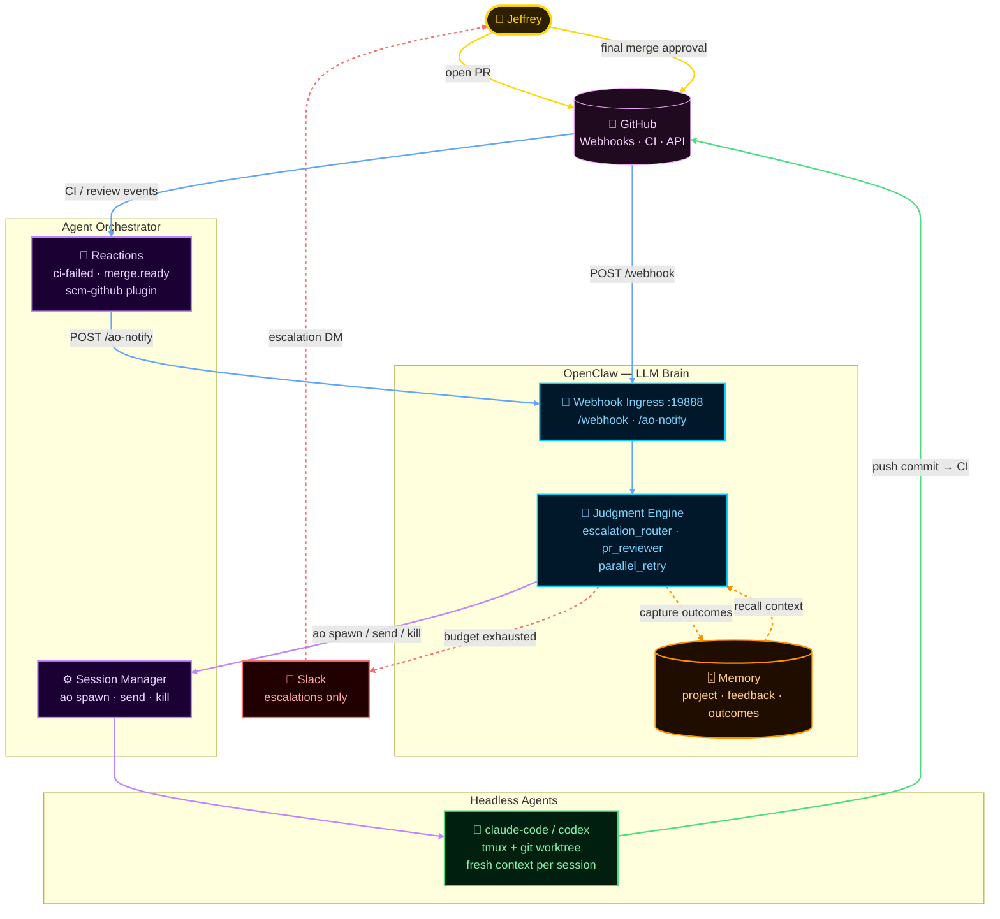
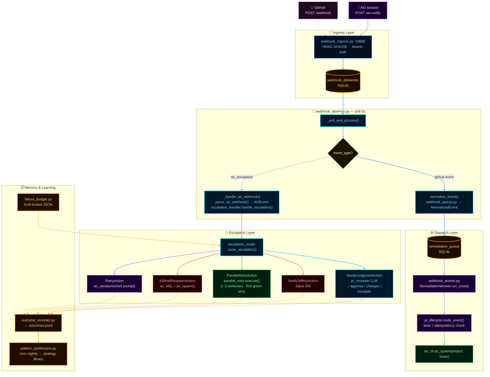
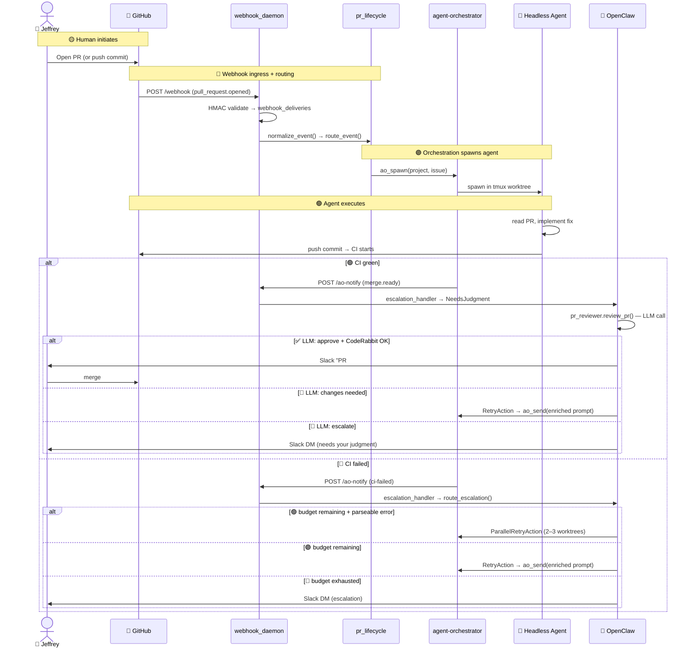
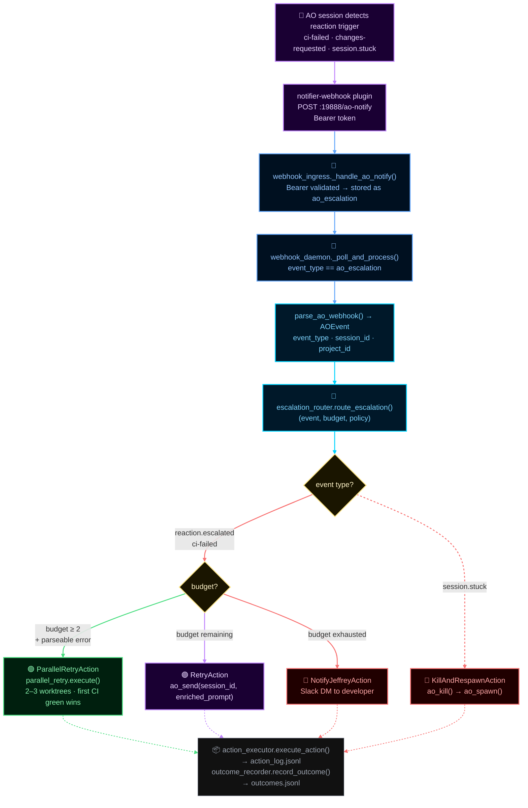

# OpenClaw Orchestration System Design Document

> **Last updated:** 2026-03-15
> **Status:** Living document — updated as the system evolves

---

## Table of Contents

1. [Background](#background)
2. [Goals & Tenets](#goals--tenets)
3. [System Explanation](#system-explanation)
   - [The Core Idea: Replace Yourself](#the-core-idea-replace-yourself)
   - [Memory as a First-Class Citizen](#memory-as-a-first-class-citizen)
   - [Deterministic First, LLM for Judgment](#deterministic-first-llm-for-judgment)
   - [Feedback Loop Architecture](#feedback-loop-architecture)
4. [High-Level System Diagram](#high-level-system-diagram)
5. [Low-Level Component Diagram](#low-level-component-diagram)
6. [Component Reference](#component-reference)
   - [Ingress Layer](#ingress-layer)
   - [Dispatch Layer](#dispatch-layer)
   - [Escalation Layer](#escalation-layer)
   - [Review Layer](#review-layer)
   - [Memory Layer](#memory-layer)
7. [Data Flow: GitHub PR Lifecycle](#data-flow-github-pr-lifecycle)
8. [Data Flow: AO Escalation](#data-flow-ao-escalation)
9. [Merge-Readiness Contract](#merge-readiness-contract)
10. [Implementation Status](#implementation-status)
11. [North Star: What Full Autonomy Looks Like](#north-star-what-full-autonomy-looks-like)
12. [Daily Bug Hunt](#daily-bug-hunt)

---

## Background

Software development is mostly waiting: waiting for CI, waiting for reviews, waiting
to remember what you were doing last week, waiting to context-switch back into a PR
you opened two days ago.

This system exists to eliminate that waiting for a solo developer by building an
autonomous agent loop that handles the predictable 80% of the development cycle —
CI failures, PR review comments, merge conflicts, CodeRabbit approvals — and only
surfaces work to the human when genuine judgment is required.

The system is built on top of three real tools:

- **OpenClaw** — LLM-powered agent runtime with persistent memory, webhooks, and skill dispatch
- **agent-orchestrator (AO)** — session lifecycle manager: spawns/kills headless agent sessions in tmux worktrees, monitors CI/review state, auto-remediates deterministically
- **Headless agents** — `claude-code`, `codex`, or `gemini` sessions running inside AO worktrees, each with fresh context and a specific task

OpenClaw sits *above* the AO loop. It has persistent memory across sessions. It
makes the same decisions the developer would make — routing CI failures to retries,
interpreting vague review comments, deciding when a PR needs human eyes. AO does
the grunt work; OpenClaw provides the judgment.

---

## Goals & Tenets

### 1. Replace Yourself

The north star is: **Jeffrey (or any developer) only sees work when it genuinely
needs human judgment or final approval.** Everything else is handled autonomously.

Practically, this means:
- A PR opened on Monday should be merged by Monday — CI failures auto-fixed, review
  comments auto-addressed, CodeRabbit approval obtained, merge-readiness gates passed
- The developer's GitHub notification feed should be near-empty: only escalations,
  product-level ambiguities, and final merge approvals
- The system should be better at fixing its own mistakes over time, not worse

### 2. Memory Makes the System Smarter

A stateless agent is permanently dumb. This system has three memory tiers that
compound across every task:

| Tier | What it stores | Used for |
|------|---------------|---------|
| **Project memories** | Codebase conventions, known patterns, historical decisions | Every LLM call gets context the agent earned from prior sessions |
| **Feedback memories** | Corrections and preferences from the developer | Shapes judgment — the agent learns what Jeffrey would have said |
| **Outcome ledger** | Which fix strategies succeeded or failed, indexed by error class | Future retries skip strategies that didn't work before |

Without memory, every CI failure is the first CI failure the system has ever seen.
With the outcome ledger, a `ModuleNotFoundError` on a Django project triggers a
known-good fix strategy instead of random exploration.

### 3. Deterministic First, LLM for Judgment

The LLM is expensive, slow, and occasionally wrong. Deterministic code is cheap,
fast, and predictable. The split:

| Signal | Who decides |
|--------|-------------|
| CI failed ≤ retry cap | AO deterministic rule |
| Review comment received | AO deterministic rule |
| CI failed, retry budget ≥ 2 remaining, parseable error | OpenClaw spawns parallel fix strategies |
| Agent session idle > threshold | OpenClaw kills and respawns |
| Retry budget exhausted | OpenClaw escalates to developer |
| PR approved + CI green | OpenClaw LLM reviews PR |
| Vague review comment | OpenClaw LLM interprets + dispatches fix |
| Risky change in sensitive path | OpenClaw LLM escalates with warning |

The LLM is not called for routine reactions. It handles the 20% that requires
interpretation, strategy, or risk judgment.

### 4. Fail Closed, Escalate Explicitly

The system never silently fails. When uncertainty or budget exhaustion is reached:
- A Slack notification goes to the developer with full context
- The session is killed, not left running in a broken state
- The failure reason is stored in the outcome ledger for learning

Confidence scores gate LLM judgment calls. If `confidence < 0.6`, the system
escalates rather than acting on a low-confidence decision.

### 5. Config-First, Code as Last Resort

Before writing Python, check if the goal can be achieved by editing config files.
OpenClaw has rich built-in capabilities — cron, memory, webhook routing, skill
dispatch. New Python in `src/orchestration/` is only justified for capabilities
that genuinely don't exist in the config surface.

---

## System Explanation

### The Core Idea: Replace Yourself

The developer's job in the current automated loop is:
1. Write code and open a PR
2. Wait for CI and review
3. Fix whatever broke
4. Repeat until mergeable
5. Approve the merge

Steps 2–4 are mechanical for 80% of PRs. The orchestration system handles those
steps autonomously. The developer only does step 1 (intent) and step 5 (final
approval).

The key insight: **autonomous remediation is only reliable if the system has memory
of what worked before and can detect when it's failing.** Without the outcome
ledger, the system burns retries on strategies that have never worked. Without the
failure budget, it loops forever. Without escalation, the developer never finds out
the loop is broken.

### Memory as a First-Class Citizen

Memory is not a feature — it's the prerequisite for the system getting smarter over
time instead of staying permanently dumb.

**How memory flows through the system:**

```
Agent session completes
  ↓ outcome_recorder.record_outcome(error_class, strategy, result)
  ↓ outcomes.jsonl: {error_class, strategy, success, timestamp}
  ↓
pattern_synthesizer.py (cron, nightly)
  → "for ImportError on Django models, strategy-B wins 78% of the time"
  ↓
generate_fix_strategies() seeds with known-winning strategies for next retry
```

**Feedback memories shape OpenClaw's judgment:**

```
Developer: "stop marking PRs ready when CodeRabbit has open comments"
  ↓ OpenClaw stores feedback memory
  ↓ Future PR reviews: memory injected into review_pr() LLM context
  → OpenClaw applies the correction without being told again
```

**Project memories prevent repeated mistakes:**

```
"In this repo, tests must be committed separately from implementation"
  ↓ Stored in project memory during onboarding
  ↓ Every new agent session gets this as context
  → Agents follow the convention without per-session re-instruction
```

### Deterministic First, LLM for Judgment

See [Goals & Tenets](#goals--tenets) tenet 3 for the decision matrix.

The routing engine (`escalation_router.py`) applies rules top-to-bottom:

```
reaction.escalated
  ├── attempts ≤ max_retries AND budget ≥ 2 AND parseable CI error
  │     → ParallelRetryAction (spawn 2–3 sessions with different strategies)
  ├── attempts ≤ max_retries (single retry path)
  │     → RetryAction (ao send enriched prompt)
  └── attempts > max_retries
        → NotifyJeffreyAction (budget exhausted)

session.stuck (idle > threshold)
  → KillAndRespawnAction

merge.ready
  → auto_review_trigger → OpenClaw LLM reviews PR
    ├── approve   → post GH review + notify developer "ready to merge"
    ├── changes   → post GH review + RetryAction
    └── escalate  → notify developer "needs your eyes"
```

### Feedback Loop Architecture

The full loop from PR open to merge:

```
1. Developer opens PR
2. GitHub webhook → webhook_daemon:19888 → ao_spawn
3. AO session starts: reads PR, implements fix, pushes
4. CI runs → AO detects result via scm-github plugin
5. CI green → AO triggers merge.ready → pr_reviewer
6. CI failed → AO triggers reaction.escalated → escalation_handler
7. escalation_handler routes deterministically:
   a. Retries remaining → ao send enriched fix prompt
   b. Budget exhausted → Slack DM to developer
8. On pr_reviewer approve → CodeRabbit gate check
9. All gates pass → notify developer to merge
```

---

## Color Legend

| Color | Layer / Meaning |
|-------|----------------|
| 🟡 **Gold** | Human decision points (Jeffrey) |
| 🔵 **Cyan** | Intelligence layer — OpenClaw LLM, judgment engine |
| 🟠 **Orange** | Memory & persistent storage (mem0, SQLite, outcomes) |
| 🟣 **Purple** | Orchestration layer — AO session management |
| 🟢 **Green** | Execution layer — headless agents · success/happy paths |
| 🔴 **Red** | Escalation paths · destructive actions · alerts |
| 🩷 **Pink** | External services (GitHub, Slack) |
| 🔵 **Blue** | Data flow — webhook routing, ingress, normalization |

---

## High-Level System Diagram



---

## Low-Level Component Diagram



---

## Component Reference

### Ingress Layer

| File | Role |
|------|------|
| `webhook_ingress.py` | HTTP server on :19888, HMAC/Bearer auth, SQLite store |
| `webhook_queue.py` | SQLite queue schema, `NormalizedEvent`, dedup logic |
| `webhook_daemon.py` | Supervised process: ingress + worker + AO routing |
| `webhook_bridge.py` | GitHub event normalization helpers |
| `event_util.py` | `trigger_type_for()`, `normalize_trigger_type()` |

### Dispatch Layer

| File | Role |
|------|------|
| `webhook_worker.py` | Polls remediation queue, acquires PR lock, calls ao_spawn |
| `ao_cli.py` | Subprocess wrappers: `ao_spawn`, `ao_send`, `ao_kill`, `ao_list` |
| `pr_lifecycle.py` | Lane routing, duplicate suppression, catch-up classification |
| `decomposition_dispatcher.py` | Splits large tasks into parallel subtasks (max 4) |
| `task_tracker.py` | Tracks subtask state across sessions |

### Escalation Layer

| File | Role |
|------|------|
| `escalation_handler.py` | Entry point: parse → route → execute → log |
| `escalation_router.py` | Deterministic rules → action types |
| `escalation.py` | Consolidated escalation module (refactored) |
| `action_executor.py` | Executes actions: ao send/kill/spawn, Slack notify |
| `failure_budget.py` | Persistent per-task retry + strategy change budgets |
| `ao_events.py` | Parse AO native webhooks into typed `AOEvent` |

### Review Layer

| File | Role |
|------|------|
| `pr_reviewer.py` | Builds `ReviewContext` from PR, CI, memory, CLAUDE.md |
| `pr_review_decision.py` | LLM call → `ReviewDecision` (approve/changes/escalate) |
| `auto_review_trigger.py` | Handles `merge.ready` event → calls `review_pr()` |
| `coderabbit_gate.py` | Checks CodeRabbit approval status before merge-ready |

### Memory Layer

| File | Role |
|------|------|
| `outcome_recorder.py` | Records winning/losing strategies per error fingerprint |
| `pattern_synthesizer.py` | Cron: synthesizes outcome patterns into strategy library |
| `parallel_retry.py` | Spawns 2–3 parallel fix sessions, picks winner |

---

## Data Flow: GitHub PR Lifecycle



---

## Data Flow: AO Escalation



---

## Merge-Readiness Contract

A PR is considered merge-ready only when **all five** are true:

| Gate | Source | Check |
|------|--------|-------|
| CI green | GitHub Actions | All required checks `conclusion == success` |
| No conflicts | GitHub API | `mergeable == "MERGEABLE"` |
| No serious comments | CodeRabbit, Copilot, Cursor Bugbot | No `REQUEST_CHANGES` verdict |
| Evidence reviewed | CodeRabbit / Codex via `/er` | Evidence review PASS or WARN |
| OpenClaw approved | `pr_reviewer.py` LLM | `ReviewDecision.approve` |

The developer only needs to hit the merge button. The system tells them when.

---

## Implementation Status

| Component | Module | Status |
|-----------|--------|--------|
| GitHub webhook ingress | `webhook_ingress.py` | ✅ Live (port 19888, HMAC) |
| AO escalation ingress | `webhook_ingress.py /ao-notify` | ✅ Live (Bearer auth) |
| GitHub → ao_spawn dispatch | `webhook_worker.py` | ✅ E2E proven |
| AO → escalation_handler routing | `webhook_daemon.py` | ✅ E2E proven |
| Escalation router | `escalation_router.py` | ✅ Implemented |
| Failure budgets | `failure_budget.py` | ✅ Implemented |
| Parallel retry | `parallel_retry.py` | ✅ Implemented |
| PR reviewer (LLM) | `pr_review_decision.py` | ✅ Wired to Claude API |
| CodeRabbit gate | `coderabbit_gate.py` | ✅ Implemented |
| Evidence review gate | `evidence_review_gate.py` | ✅ Implemented |
| Evidence review command | `.claude/commands/evidence_review.md` | ✅ Implemented |
| Outcome recorder | `outcome_recorder.py` | ✅ Implemented |
| Pattern synthesizer | `pattern_synthesizer.py` | ✅ Implemented (cron) |
| Daily bug hunt (9am) | `scripts/bug-hunt-daily.sh` | ✅ Implemented (cron) |
| Self-improving prompts | — | 🔴 Not started (orch-4vl8) |
| Auto-triage notifications | — | 🔴 Not started (orch-w3i1) |
| Convergence Intelligence Layer | — | 🔴 Not started (orch-cn8y) |

**Test coverage:** 429 unit tests passing.

---

## North Star: What Full Autonomy Looks Like

When the system is complete:

1. **Jeffrey opens a PR** → system handles everything until merge-ready
2. **GitHub notification feed is empty** → system surfaces only escalations and final approvals
3. **The system gets smarter** → outcome ledger means second CI failure on same error class is fixed faster than the first
4. **Feedback persists** → corrections from developer shape every future judgment call without re-instruction
5. **Parallel strategies** → instead of 3 sequential retries (30 min), 3 parallel strategies (10 min)
6. **Proactive triage** → GitHub notifications across all repos automatically triaged into AO sessions (ORCH-w3i1)
7. **Anomaly detection** → if the same error class keeps escalating, system creates a bead and notifies before Jeffrey asks (ORCH-cn8y)

The end state: Jeffrey reviews a Slack message that says "PR #173 is merge-ready" and hits merge. The 2 hours of CI debugging and comment-fixing in between never touched his attention.

---

## Daily Bug Hunt

A daily automated bug hunting job that runs at 9am Pacific time on weekdays. It spawns multiple AI agents (Codex, Cursor, Minimax, Gemini) in parallel to scan recently merged PRs for bugs.

### How It Works

```
9am weekdays (Pacific)
    ↓
Get PRs merged in last 2 days from jleechanorg repos
    ↓
Spawn 4 parallel agents (codex, cursor, minimax, gemini)
    ↓
Each agent:
  - Reviews PRs for bugs
  - Creates bug_reports/*.md files
  - Creates beads for critical bugs
    ↓
Post summary to #bug-hunt Slack channel
    ↓
Ask OpenClaw to fix via agento
```

### Components

| Component | Path | Description |
|-----------|------|-------------|
| Bug hunt script | `scripts/bug-hunt-daily.sh` | Main orchestration script |
| Launchd plist | `launchd/ai.openclaw.schedule.bug-hunt-9am.plist` | macOS scheduler |
| OpenClaw cron | `daily-bug-hunt-9am-pacific` | Gateway cron job |
| Bug reports | `bug_reports/` | Output directory for bug reports |

### Repos Scanned

- `jleechanorg/jleechanclaw`
- `jleechanorg/worldarchitect.ai`
- `jleechanorg/ai_universe`
- `jleechanorg/beads`

### Output

Each bug report includes:
- Repository and PR number
- File path and line number
- Bug description
- Severity (1-5)
- Suggested fix

Bugs are automatically converted to beads for tracking.
