# 3-Stage OpenClaw Dev Pipeline

> **Status**: Operational as of 2026-03-31.

## Background

Before this pipeline, changes to `~/.smartclaw/` (the live gateway config) went straight to production with no safety gate. A bad `openclaw.json` edit could crash the gateway, drop Slack messages, or break all agent sessions. Manual review caught some cases, but not consistently.

The 3-stage pipeline (orch-1ps epic) adds automated safety gates between `~/.smartclaw/` and unvalidated changes:

1. **Staging branch** — changes land on `staging` branch first, not `main`
2. **Canary** — automated health checks run against a staging gateway before any promotion
3. **CI gate** — portable checks run on every PR, blocking merge on failure

## Architecture

```
┌──────────────────────────────────────────────────────────────────────────────────────────┐
│  ~/.smartclaw/  (PROD — live gateway on port 18789)                                      │
│  Branch: main                                                                          │
│  Pulls from origin/main via git pull or webhook                                        │
└───────────────────────────────┬──────────────────────────────────────────────────────────┘
                                │ git pull / merge
                                │ (staging-promote.sh)
                                ▲
                                │ ~/.smartclaw-staging/  (WORKTREE — staging gateway)
┌───────────────────────────────┴──────────────────────────────────────────────────────────┐
│  ~/.smartclaw-staging/  (STAGING — staging gateway on port 18790)                        │
│  Branch: staging                                                                       │
└───────────────────────────────┬──────────────────────────────────────────────────────────┘
                                │ PR merged to staging branch
                                ▼
┌──────────────────────────────────────────────────────────────────────────────────────────┐
│  PR workflow                                                                          │
│  1. Agent edits files in a feature worktree                                              │
│  2. Opens PR targeting: staging (not main)                                              │
│  3. CI gate fires: staging-canary-gate.yml → portable checks (2/6)                     │
│  4. PR merged to staging → staging worktree updates via git worktree                     │
│  5. staging-promote.sh: canary against staging gateway (6/6) → merge staging → main    │
│  6. Production picks up change via git pull; if gateway restart needed: stop && start   │
└──────────────────────────────────────────────────────────────────────────────────────────┘
```

### Mermaid diagram

```mermaid
flowchart LR
    subgraph FeatureWorktree["Feature worktree (agent session)"]
        A[Edit files]
    end

    subgraph GitHub["GitHub"]
        PR["PR → origin/staging"]
        CI["staging-canary-gate.yml\nportable checks 2/6"]
    end

    subgraph StagingEnv["~/.smartclaw-staging/  (port 18790)"]
        SW[Staging worktree\nbranch: staging]
        SG[Staging gateway]
    end

    subgraph ProdEnv["~/.smartclaw/  (port 18789)"]
        PW[Prod worktree\nbranch: main]
        PG[Prod gateway]
    end

    A --> PR
    PR --> CI
    PR -->|"PR merged"| SW
    SW -->|"worktree update"| SG
    SG -->|"staging-promote.sh\n6/6 canary"| PW
    PW -->|"git pull"| PG

    style SW fill:#1a3a2a
    style SG fill:#1a3a2a
    style PW fill:#1a2a3a
    style PG fill:#1a2a3a
    style CI fill:#2a1a3a
```



## Stage 1 — Staging Branch + Worktree

**Files**: N/A (git infrastructure)

**What it does**:
- A long-lived `staging` branch exists in `jleechanorg/smartclaw`
- `~/.smartclaw-staging/` is a git worktree checked out to the `staging` branch
- When the staging branch is updated (via PR merge, not direct push), `~/.smartclaw-staging/` updates via the worktree mechanism when `staging-promote.sh` next runs — it merges the updated `origin/staging` into the local worktree
- Manual fallback remains valid if needed: `git -C ~/.smartclaw-staging pull`

**Why worktree over plain directory**: A worktree is tied to the git repo. Any changes in `~/.smartclaw-staging/` can be committed back to the staging branch. A plain directory requires manual sync.

**Creating the staging worktree** (done once):

```bash
# Ensure staging branch exists and matches main
git fetch origin staging
git branch --set-upstream-to=origin/staging staging 2>/dev/null || \
  git branch staging origin/staging 2>/dev/null || true

# Add worktree if not present
git worktree add ~/.smartclaw-staging origin/staging
```

**Staging sync invariant**: After any staging branch creation or reset, verify staging is at or ahead of main (never behind). Run `git rev-list staging..main --count` — if the output is non-zero, staging is behind main and must be fast-forwarded. A stale staging branch would be a regression path.

## Stage 2 — Auto-Promote

**File**: `scripts/staging-promote.sh`

**What it does**:
1. Verifies `~/.smartclaw-staging/` is a valid worktree on the `staging` branch
2. Runs `scripts/staging-canary.sh --port 18790` against the staging gateway
3. If all 6 canary checks pass: merges `staging → main` in `~/.smartclaw/` and pushes to origin
4. If any check fails: exits with error, no promotion

**Key guards**:
- Refuses to promote if staging is not a worktree (prevents plain-directory confusion)
- Refuses to promote if staging worktree is not on the `staging` branch
- Aborts any in-progress merge before starting (idempotent)
- Stashes uncommitted local changes before merging

**Usage**:

```bash
# Run after merging a PR to the staging branch
bash scripts/staging-promote.sh

# Verify prod after promotion
bash scripts/staging-canary.sh --port 18789
```

**Fail-closed**: Any canary failure = no promotion. The script exits with non-zero and prints the failing check.

## Stage 3 — CI Gate

**File**: `.github/workflows/staging-canary-gate.yml`

**What it does**: Fires on every PR (`pull_request` event). Detects whether `openclaw.json` changed in the PR diff. If so, runs the full canary (which also reads `package.json` for Check 5 — SDK protocol version). The `staging-canary-gate` does not trigger on `package.json` changes alone (no openclaw.json changed); the `skeptic-gate` still reviews all PRs.

**Checks run in CI**:

| Check | What it does | Runs in CI? |
|-------|-------------|-------------|
| 1. Gateway health | `/health` endpoint responds | No — needs local gateway |
| 2. Config schema | JSON valid, no crash-keys, critical keys present | **Yes** |
| 3. Native module ABI | `better-sqlite3` loads with correct Node | No — needs local Node + extensions |
| 4. Slack token validity | `apps.connections.open` succeeds | No — needs live gateway |
| 5. SDK protocol version | `@agentclientprotocol/sdk` ≤ 0.16 | **Yes** |
| 6. Heartbeat latency | `/health` responds in < 5s | No — needs local gateway |

CI runs checks 2 and 5 (static analysis, no local gateway needed). The remaining 4 checks must be run locally.

**CI gate behavior**:
- PRs touching `openclaw.json` are blocked from merging if CI fails (the `staging-canary-gate` does not trigger on `package.json` changes alone; `skeptic-gate` still reviews all PRs)
- Non-config PRs (docs-only, etc.) skip the `staging-canary-gate` silently (skeptic-gate still reviews all PRs)
- Results posted as PR comment so developers always see the outcome

## The Full Canary (6/6 Checks)

**File**: `scripts/staging-canary.sh`

The full canary must be run **locally** against the staging gateway before merging staging → main. This is the final human/gate check before production promotion.

```bash
# Start staging gateway (one-time or after machine reboot)
bash scripts/staging-gateway.sh start

# Run full canary
bash scripts/staging-canary.sh --port 18790
```

The canary exits `0` only if all 6 checks pass. A failure blocks `staging-promote.sh`.

### Gateway management

```bash
bash scripts/staging-gateway.sh start   # Start staging gateway on port 18790
bash scripts/staging-gateway.sh stop   # Stop staging gateway
bash scripts/staging-gateway.sh status # Show PID, port, health
```

The staging gateway is a separate process from the production gateway (port 18789). It shares the same binary and Node.js but uses `~/.smartclaw/staging/openclaw.json` as its config.

## Day-to-Day Workflow

### Normal PR flow (agent or human editing `~/.smartclaw/` files)

```bash
# 1. In feature worktree: edit the file you want to change
#    e.g., openclaw.json, agents/, skills/, SOUL.md, etc.

# 2. Open PR targeting: staging (NOT main)
#    gh pr create --base staging --head feat/my-change

# 3. CI gate fires automatically
#    If it fails: fix the config issues, push

# 4. Merge PR to staging
#    staging-promote.sh merges origin/staging into the local staging worktree
#    (manual fallback: git -C ~/.smartclaw-staging pull)

# 5. Run canary against staging gateway
bash scripts/staging-canary.sh --port 18790
#    If it fails: investigate, fix in a new PR

# 6. Promote staging → main
bash scripts/staging-promote.sh

# 7. Production picks up the change via git pull; if needed: stop && start the gateway
```

### Gateway config change (openclaw.json, agents/, skills/)

Same as above — edit in feature worktree, PR → staging, canary → promote.

### Non-config changes (docs, scripts, Python source)

PR → main directly. CI runs as normal. No staging gate required (gate skips non-config PRs).

## Known Gaps

### orch-1ps.4 — Git hooks for auto-restart (P1, not yet implemented)

**What was intended**: Post-receive or post-merge hooks in the `~/.smartclaw-staging/` worktree that automatically restart the staging gateway when the staging branch is updated.

**Why it's not done**: The current workflow requires manual gateway restart after a staging promotion. Without the hook, the staging gateway keeps running with the old config until manually restarted.

**Workaround**: Run `bash scripts/staging-gateway.sh stop && bash scripts/staging-gateway.sh start` after any staging promotion.

**What building this would involve**:
- A `post-merge` or `post-receive` hook in `~/.smartclaw-staging/.git/hooks/`
- The hook detects `git pull` or merge in the staging worktree
- Calls `bash scripts/staging-gateway.sh stop && bash scripts/staging-gateway.sh start`

## Staging Sync Caveat

**The staging branch must stay in sync with main.**

A bug in the initial orch-1ps.1 implementation created the staging branch from a Saturday commit instead of current main. This meant staging had 3 days of older history. Promoting from stale staging would have been a regression — staging would overwrite newer main changes.

**Rule**: After any staging branch creation or reset, verify:

```bash
git rev-list staging..main --count
```

If this returns non-zero, staging is behind main and must be fast-forwarded:

```bash
git checkout staging
git merge --ff-only origin/main
git push origin staging
```

## Implementation History

| Item | Status | PR | Date |
|------|--------|-----|------|
| orch-1ps.1 — Staging branch + worktree | Done | — | 2026-03-31 |
| orch-1ps.2 — staging-promote.sh | Done | #459 merged | 2026-03-31 |
| orch-1ps.3 — CI gate (staging-canary-gate.yml) | Done | #458 merged | 2026-03-31 |
| orch-1ps.4 — Git hooks for auto-restart | Open (P1) | — | — |

## Related Documentation

- `scripts/staging-canary.sh` — 6-point canary test (source of truth for checks)
- `scripts/staging-promote.sh` — promotion logic
- `scripts/staging-gateway.sh` — staging gateway lifecycle management
- `.github/workflows/staging-canary-gate.yml` — CI gate workflow
- `roadmap/ORCHESTRATION_DESIGN.md` — orchestration system design
- `memory/project_3stage_pipeline_design.md` — design decisions from Slack #C0AJ3SD5C79
